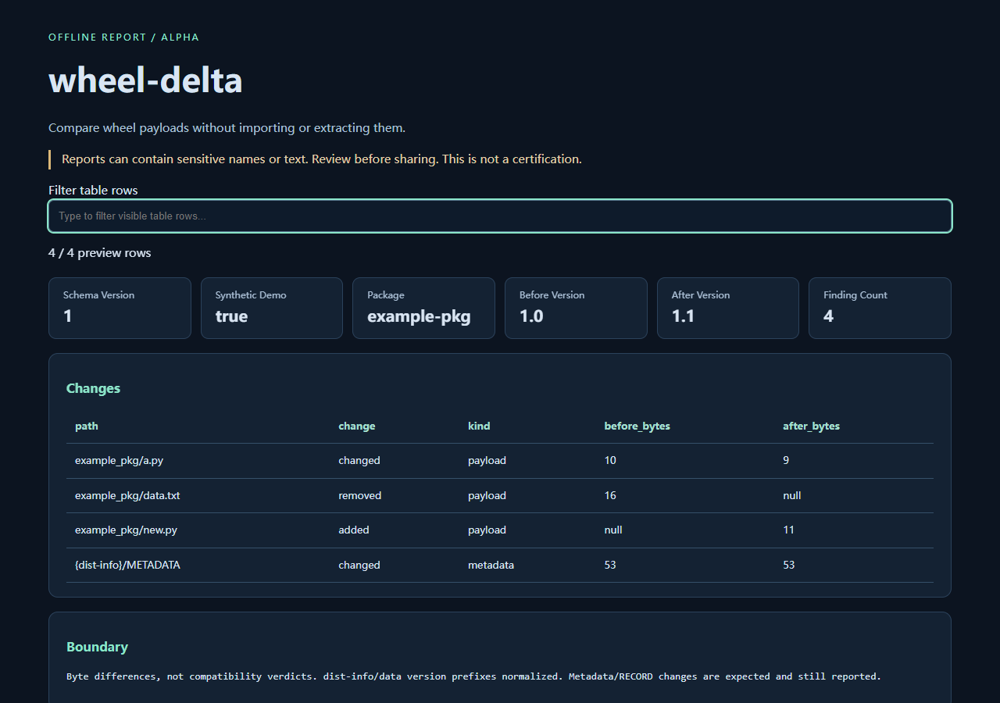

# wheel-delta

**Compare wheel payloads without importing or extracting them.** Local-only alpha. Python 3.10+, zero runtime dependencies.

[中文](README.zh-CN.md) · [Synthetic report](https://shkyyy18.github.io/wheel-delta/)

## Try

Download the wheel from this repository's v0.1.0 GitHub Release; install into a virtual environment:

```sh
python -m pip install /path/to/wheel_delta-0.1.0-py3-none-any.whl
wheel-delta --demo --html synthetic-report.html --json synthetic-report.json
```

Open the HTML offline. The example is synthetic, not customer evidence. No PyPI release is claimed;
do not assume a same-named PyPI package is this code. Source installation: `python -m pip install .`.
Real input commands and finding-count semantics: [usage](docs/usage.md), `wheel-delta --help`.

## Scope and alternatives

Not an ABI/API compatibility or malware scanner. No RECORD validation. Filenames may be sensitive. Bounded ZIP reads; never extract.

Adjacent open-source tools / primary format sources:
- https://github.com/jwodder/check-wheel-contents
- https://github.com/pypa/packaging.python.org

References establish adjacent tools, not unmet demand or missing competitor features. This is
an independent small implementation, not a fork or a claim to replace mature tools.
No independent user validation, production readiness or security certification is claimed.

## Privacy and failure behavior

No input execution, uploads, telemetry, automatic edits or persistent service. Reports may contain
names, paths, schema or subtitle text. Review before sharing. Default input limit: 8 MiB; wheel/database
exceptions are documented in usage. HTML previews cap each table at 1,000 rows and label truncation;
JSON holds the complete bounded result. JSON input rejects duplicate keys and non-finite numbers.
Outputs must be NEW distinct files; existing files are never overwritten. A later output write failure
can leave an earlier output, so use a new directory for each run. No automatic cleanup.

Exit 0: analysis completed, not correctness/safety. `--fail-on-findings`: findings exit 1.
Malformed/unsupported input or output error: exit 2, no complete result.

## Develop

```sh
python -m unittest discover -s tests -v
python -m pip install build
python -m build
python scripts/smoke.py
```

Smoke installs the built wheel into a fresh temporary environment and runs outside the source tree.
CI configuration alone is not success; inspect actual workflow runs. MIT license.
Use synthetic data in bug reports; never attach private inputs or credentials.

### Windows application-control fallback

If Windows blocks the pip-generated console `.exe`, keep your security policy enabled and use the equivalent installed module:

```sh
python -m wheel_delta --demo
```

## Synthetic output preview



## Try a missing-resource review

[Run the synthetic before/after trial](docs/missing-resource-trial.md): distinguish an
intended version-only metadata change from a deliberately missing package template.
Includes a control case and explains why `--fail-on-findings` flags both.
